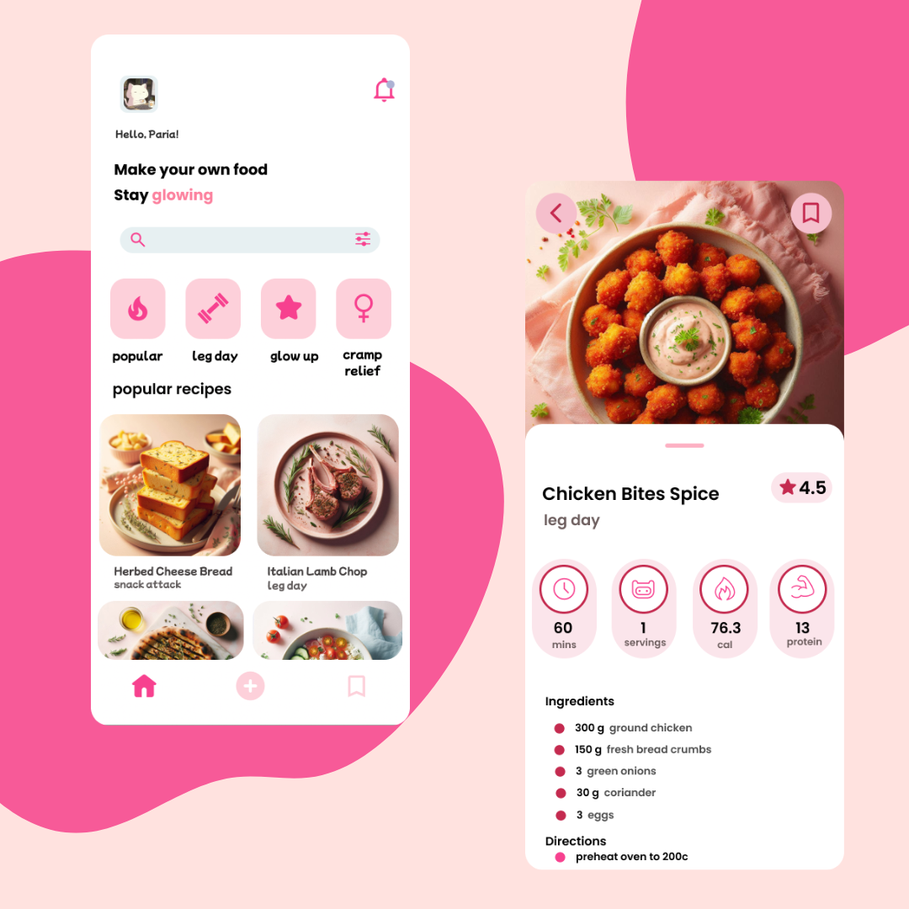

# 🧁 ChefMoi  
*A mood-based AI recipe recommender built for glow-ups, gym days, and your feminine vibe.* 🍓

---

## 👩🏻‍🍳 What’s ChefMoi About?

Ever wished your meal matched your *mood* — not just your macros?  
ChefMoi is my take on a vibe-matching AI that understands cravings like “cramp-relief comfort” or “lazy girl dinner.”  
It’s part machine learning, part lifestyle tool, and a whole lot of me.

Yes, I built it at 2AM with iced tea, Figma, and a playlist running — but it turned into something I’m really proud of 💖

---

## 🧃 What’s in the Repo

- `data_cleaning.py` → My custom (and sometimes chaotic) data cleaning pipeline  
- `recipe_recommender.py` → Core recommendation engine using TF-IDF & cosine similarity  
- `paria_recipes.csv` → 180+ real recipes I manually tagged with lifestyle moods like `glow_up`, `cramp_relief`, `lazy_girl_dinner`  
- `images/` → Aesthetic visuals I matched with recipes for future UI  
- `assets/` → UI preview made in Figma  
- `requirements.txt` → Coming soon, oops 😅

---

## 📊 Dataset Details

Originally from [Food.com Recipes and Interactions](https://www.kaggle.com/datasets/shuyangli94/food-com-recipes-and-user-interactions), the dataset had over 230k messy entries.  
I narrowed it down, cleaned it, and created a new column called `paria_tag` — the heart of this whole idea.

Tags include:
- `gut_healing`  
- `lazy_girl_dinner`  
- `glow_up`  
- `post_leg_day`  
- `comfort_cute`  
- `cramp_relief`  
...and more based on actual mood and meal intent.

---

## 🤖 How It Works

ChefMoi uses **content-based filtering**:
- Combine `ingredients` + `paria_tag` into a new column (`combined_columns`)
- Vectorize that text using **TF-IDF**
- Measure cosine similarity between recipes
- Recommend top 5 recipes that match the ~vibe~ of the input

```python
get_similar_recipe("Grilled Pizza Crust")
```

Returns:
```text
- Garlic Chicken Spaghetti (83.5%)
- BLT Pizza (78.4%)
- Cramp-Relief Nachos (75.9%)
- Easy Chickpea Bowl (74.0%)
- Spinach Cream Pasta (71.8%)
```

---

## 🎨 UI Mockup

I designed a simple mobile UI in Figma — pastel, soft, and personalized (just like the food vibes).



---

## 💖 Why I Built This

I didn’t just want another ML project. I wanted something that reflects how I think about wellness, aesthetics, and tech.  
ChefMoi was my way of blending code with care — and learning how to build something that could *feel* human.

---

## 🌱 Real-World Impact

This project could become:
- A self-care food planner for women  
- A cycle-aware nutrition assistant  
- A vibe-based food discovery tool  

I’d love to:
- Add more recipes and automate tagging
- Build the full app with filters, history, etc.
- Integrate nutrition APIs for more personalized goals

---

## 🚧 Challenges

- The original data was wild: missing values, weird stringified lists
- No portion sizes = limited nutrition modeling
- Manual tagging was fun but also... exhausting
- Matching generated images to real recipes took trial and error

Still, it taught me more than any tutorial ever could — and let me create something meaningful and personal 💕

---

## ✨ Built by 

[@buildwithparia](https://github.com/buildwithparia)  
Coded with Python, playlists, late-night snacks, and a little sparkle ✨
